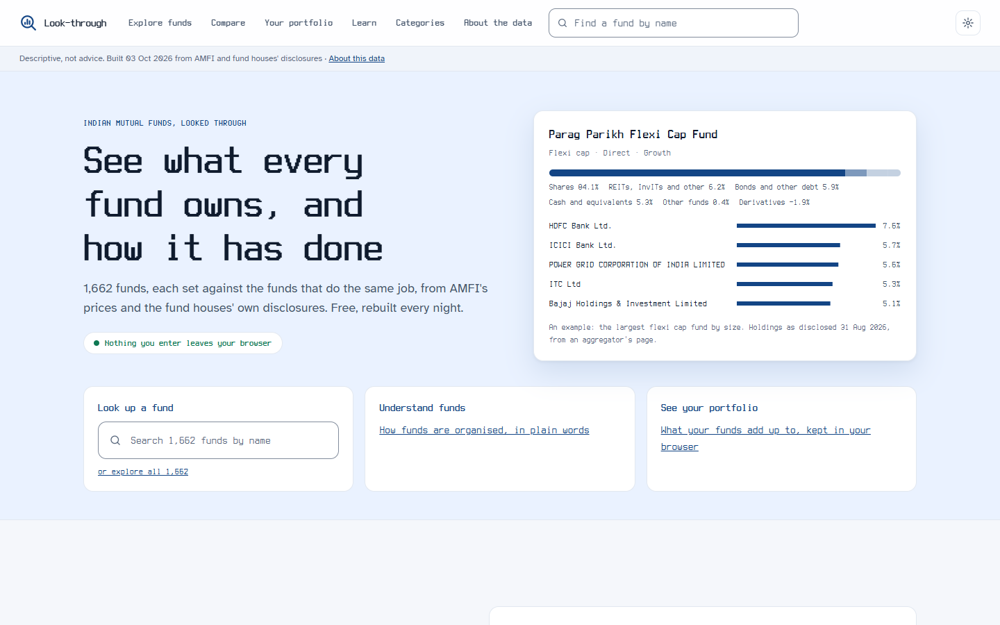
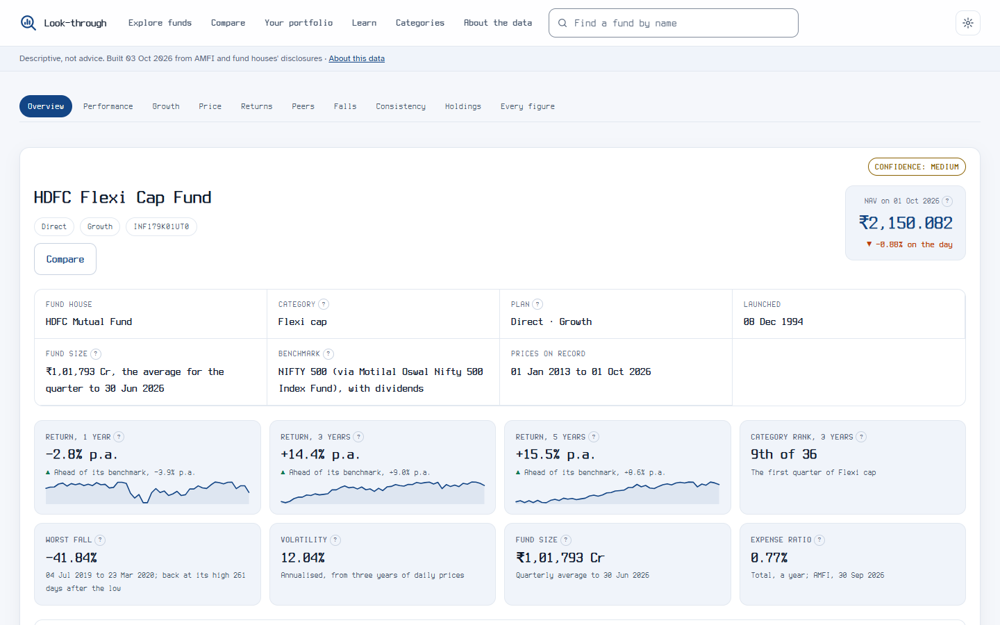
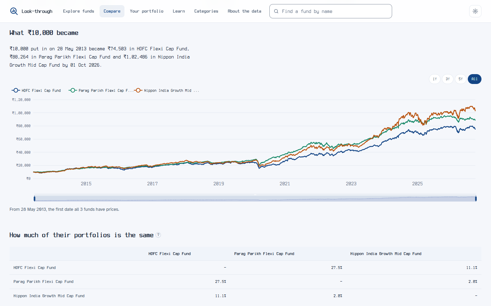
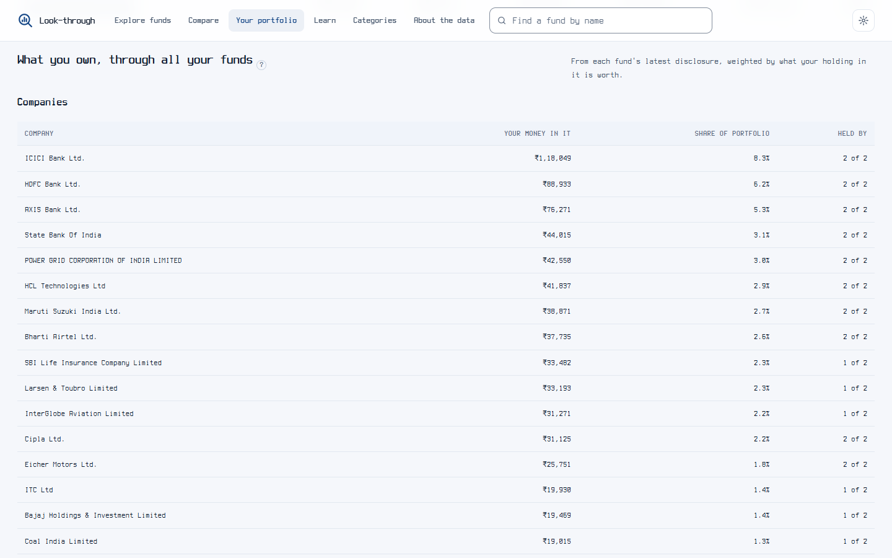

# Mutual Fund Portfolio Analyser

[](https://github.com/harshilsaini26/Mutual-Fund-Portfolio-Analyser.io/actions/workflows/ci.yml)
[](LICENSE)
[](https://www.python.org/downloads/)

**See what your mutual funds actually own.**

A self-hosted analytics workbench for Indian mutual fund investors. It looks through
the funds you hold to the companies underneath, shows how much of your money is the same
stock bought several times over, and measures each fund against the index it is supposed
to beat. It runs on your own machine; your transactions are encrypted and never leave it.

```
HDFC Flexi Cap  x  Nippon India Growth Mid Cap
    overlap        13.32%          17 shared companies of 156
    duplicated     6.66% of the portfolio held through more than one fund
```

Five equity funds look like diversification. Opened up, they are often one portfolio
bought five times, with five sets of fees. No factsheet shows this, because a factsheet
describes one fund and overlap is a property of the set.

### The public site

Every fund's page is also published, free and rebuilt every night, at
<https://didmysipwork.vercel.app/>. Nothing you enter
there leaves your browser.


| The front page | A fund page |
| --- | --- |
|  |  |
| **Compare** | **Your portfolio** |
|  |  |

---

## Contents

1. [Start it](#1-start-it)
2. [Look up any fund](#2-look-up-any-fund)
3. [Add your own portfolio](#3-add-your-own-portfolio)
4. [Load more funds' holdings](#4-load-more-funds-holdings)
5. [Keep it current](#5-keep-it-current)
6. [Publish the public fund explorer](#6-publish-the-public-fund-explorer-optional)
7. [Command reference](#command-reference) · [Troubleshooting](#troubleshooting) · [Configuration](#configuration)
8. [Why the numbers can be trusted](#why-the-numbers-can-be-trusted) · [Privacy and security](#privacy-and-security) · [For developers](#for-developers)

---

## 1. Start it

**You need** Python 3.11 or later, git, an internet connection for the first run, and
about 1.5 GB of disk for the market data. On Linux or macOS the encrypted ledger also
needs SQLCipher: `sudo apt install libsqlcipher-dev` or `brew install sqlcipher`.

```bash
git clone --single-branch https://github.com/harshilsaini26/Mutual-Fund-Portfolio-Analyser.io.git
cd Mutual-Fund-Portfolio-Analyser.io
python start.py
```

(On macOS and some Linux systems the command is `python3`. `--single-branch` skips the
`gh-pages` branch, which holds the public site's files and is not needed to run it.)

That one command does everything:

1. **Makes a private Python environment** in `.venv` and installs the pinned
   dependencies into it. This takes a minute or two, and happens again only when the
   dependency list changes.
2. **Asks once for your email.** It goes in the `From:` header of every request to AMFI,
   NSE and fund houses, so they can reach whoever is fetching. It is kept in `data/`,
   which is never committed.
3. **Loads market data from its public sources.** Each step is below. The whole first
   run takes a few minutes, plus about 70 for NSE's index history.

   | Step | What it loads |
   |---|---|
   | `prices` | today's price for every fund, and AMFI's list of funds |
   | `companies` | AMFI's list of listed companies by size |
   | `fund_sizes` | each fund's size, from AMFI's quarterly averages |
   | `kotak`, `icici` | those two fund houses' latest portfolio disclosures |
   | `portfolios` | loads the disclosures just downloaded |
   | `benchmarks` | which index each fund is measured against |
   | `history` | price history for the funds with a portfolio |
   | `index_levels` | benchmark levels from NSE: the slow one, about 70 minutes |

4. **Opens the portal** at <http://127.0.0.1:8765> in your browser. It follows your
   computer's dark or light setting; the sun and moon button in the top bar switches it.
   Until you import a statement, its home page is a short setup checklist and a search box.

If a step fails, the others still run and the next start tries it again. If you stop the
first run part-way, the next `python start.py` resumes where it stopped.
`python -m jobs.setup --list` shows which steps are done.

**Every later start** is the same command, `python start.py`. It refreshes today's prices
in seconds and opens the portal. Stop the portal with `Ctrl+C`.

### Running the other commands

`start.py` needs nothing activated. Every other command in this README runs inside the
private environment, so activate it once per terminal:

```bash
source .venv/bin/activate          # macOS / Linux
.venv\Scripts\activate             # Windows (Command Prompt or PowerShell)
source .venv/Scripts/activate      # Windows (Git Bash)
```

---

## 2. Look up any fund

Type any words of a fund's name into the search box at the top of any page, such as
`kotak small` or `parag flexi`. Every fund in AMFI's list has a page at `/fund/<ISIN>`,
and each page leads with charts, each under one plain sentence:

- **The fund at a glance:** its house, category and plan, then a strip of figures:
  returns over 1, 3 and 5 years (each beside its benchmark's, with a small chart of that
  period's prices), its rank in its category over three years, its worst fall and how
  long it took to recover, volatility, fund size, and its expense ratio (AMFI's total
  TER). Below the strip, how steady it has been across every three-year stretch.
- **Performance:** return, volatility and deepest fall over 1, 3 and 5 years beside the
  benchmark's, with Sharpe, Sortino, Treynor, alpha, beta, tracking error, information
  ratio and up and down capture, each with a line on what it says.
- **What ₹10,000 became**, against the benchmark with dividends reinvested, over 1, 3 or
  5 years or the whole record.
- **Price history:** the published NAV from its first day on record.
- **Returns by period**, fund beside benchmark.
- **Among its peers:** where it ranks among the open funds of its category (Direct
  plans, one share class each) on return, volatility, worst fall, return for the risk
  and cost, and a chart of the whole category's three-year risk against return with this
  fund marked. AMFI's category names are mid-rename; only names that certainly mean the
  same category are merged (`config/categories.yaml`), and a group that could not be
  merged cleanly says so. Funds that have closed are not counted yet, and every rank says
  that too.
- **Falls and recoveries:** how far below its last high the fund stood each day, and how
  long it took to climb back.
- **Consistency:** the return of every three-year stretch, not just the one that ends
  today.
- **What it owns:** an asset-mix ring, its largest holdings as a treemap, and bars by
  company size and by sector.

A row of section links stays pinned at the top of every fund page and marks where you
are; on a phone the panels are laid out for a narrow screen, with secondary detail one
tap away. Charts respond to hover, zoom and a click on the legend. Every panel exports to CSV, and
carries its as-of date, how stale its data is, and how much of it could not be resolved.

A fund whose price history is not loaded yet says so on its page, with the command that
loads it:

```bash
python -m jobs.backfill_scheme_nav --scheme <ISIN>
```

The same figures, as a table in the terminal:

```bash
python -m scripts.show_fund_xray --scheme INF179K01UT0
```

```
  vs NSE:NIFTY_500_TRI    bench   beta   t.err   alpha     up   down
  1y                      2.83%   0.86   3.85%   1.04%   0.82   0.89
  3y                     11.67%   0.80   4.66%   5.70%   0.63   0.91
  5y                     10.57%   0.85   4.56%   8.42%   0.63   0.97
```

---

## 3. Add your own portfolio

Your portfolio comes from a **Consolidated Account Statement (CAS)**, the statement of
every mutual fund transaction under your PAN.

**Step 1. Get the statement.** Request a *detailed* CAS (with transactions, not the summary)
from CAMS, KFintech or MF Central, for the period since your first investment. Any one of
them covers every fund house. It arrives as a PDF protected by the password you chose when
requesting it.

**Step 2. Import it.** Stop the portal (`Ctrl+C`), activate the environment
([above](#running-the-other-commands)), and run:

```bash
python -m jobs.import_cas --file path/to/statement.pdf --user USER-01
```

It asks for two things:

1. **The statement's password.** It is used to open the file and is never stored.
2. **A ledger key.** The prompt reads `Zone B ledger key`. Your transactions are kept in
   an encrypted file, `data/ledger/personal.db`, and this key locks it. On the first
   import you choose it: at least 12 characters, typed twice. After that you type the
   same key each time. **There is no recovery:** the file cannot be opened without the
   key, not even by this project.

It ends with one summary line. These are the fields to check:

| Field | What it means |
|---|---|
| `inserted` | new transactions saved |
| `duplicate` | transactions already in the ledger (re-importing is safe) |
| `unmatched` | transactions whose description it did not recognise; they are set aside, not saved |
| `unparsed_lines` | lines inside a fund's section that it could not read |
| `status` | `ok`, or `partial` when either of the two above is not zero and needs a look |

**Step 3. Look.** Run `python start.py` again and enter the ledger key when asked. The
home page becomes your dashboard: the headline figures, what you own beneath the funds,
and where your funds overlap. The sidebar lists every portfolio page:

| Page | The question it answers |
|---|---|
| Portfolio summary | Where do I stand? |
| Look-through exposure | What do I actually own, beneath the funds? |
| Fund overlap | Am I paying twice for the same thing? |
| Duplication | How much of my money is doubled up? |
| What each fund adds | What does each fund add? |
| Concentration | How concentrated am I really? |
| Size profile | What is my size profile? (large, mid and small cap, on AMFI's list at the time) |
| Holdings | What do I hold? |

Each fund in Holdings links to its fund page.

**A new statement later?** Import it the same way. Transactions already in the ledger are
recognised and skipped, so overlapping periods are fine.

**No statement to hand?** This weights every fund with a loaded portfolio equally, to
show what the output looks like. It labels itself illustrative and saves nothing:

```bash
python -m scripts.show_lookthrough --equal 1000000
```

---

## 4. Load more funds' holdings

Prices cover every fund from the start. **Holdings**, which the look-through, overlap and
"what it owns" charts depend on, must be loaded per fund house. There are three ways, in
order of preference.

**Fund houses that publish through an interface: Kotak and ICICI.** The setup already
fetches their latest disclosures. For another month:

```bash
python -m jobs.fetch_amc --amc kotak --list             # what is published
python -m jobs.fetch_amc --amc kotak --period 2026-08
python -m jobs.ingest_inbox
```

**Fund houses with a reader: HDFC, Nippon and PPFAS.** Download the house's monthly
portfolio workbook from its website into `data/inbox/`, then run:

```bash
python -m jobs.ingest_inbox
```

It works out which fund house published the file and which fund each sheet describes.
One Kotak workbook loads 88 funds and one Nippon workbook 91. A sheet it cannot identify
with certainty is skipped with a reason, never guessed at.
[`config/amc_disclosure_index.yaml`](config/amc_disclosure_index.yaml) links the
disclosure page of all 52 fund houses.

**Any other fund: the aggregator tier.** This reads the fund's public page on Groww. Find
the fund's slug in `https://groww.in/mf-sitemap.xml`. It cannot be derived from the
name, because Groww keeps the name a fund had before any rename.

```bash
python -m jobs.fetch_groww --slug <slug> --dry-run      # check it is the right fund
python -m jobs.fetch_groww --slug <slug>
```

The Groww page carries no ISINs, so fewer holdings resolve than from a fund house's own
file, and that file is always preferred while it is current.

After loading a new fund house's disclosures, run `python -m jobs.fetch_index --declared`
to pick up the benchmarks those disclosures name.

---

## 5. Keep it current

| When | What to run |
|---|---|
| Any day | `python start.py`, which refreshes today's prices before opening |
| Monthly, after the 10th | new disclosures (step 4); SEBI gives fund houses ten days after month end |
| After each new statement | `python -m jobs.import_cas ...` (step 3) |
| To see what is out of date | `python -m jobs.status` |

`jobs.status` lists, for each fund house, how many funds' disclosures are behind and by
how many months, with the exact command that fixes each. Add `--check` to also ask Kotak
and ICICI what they have published.

---

## 6. Publish the public fund explorer (optional)

A static copy of the fund pages, for anyone to browse on the web without installing
anything: every open fund with a Direct plan and a year of prices, about 1,800.

**It builds itself.** A GitHub Actions workflow (`.github/workflows/site.yml`) runs every
night and whenever you start it by hand. It builds on a fresh machine from the public
sources alone (AMFI's daily prices, categories, fund sizes and expense ratios; mfapi.in
for price history; fund houses' own portfolio files where they fetch themselves, and
Groww's fund pages for the rest), computes every figure in Python as the app does, and
pushes the site to the `gh-pages` branch, which Vercel serves as it is. Nothing is kept
between runs except the site itself,
which carries a compact copy of every fund's prices (`data/nav/`, about 30 MB) and of the
portfolios read from Groww (`data/holdings/`), so a normal night asks mfapi for nothing.
The first run fetches every fund's history, about an hour. Groww's pages are read a
hundred a night, so portfolios fill in over about sixteen nights and are then refreshed
monthly.

To turn it on, once:

1. **Settings → Secrets and variables → Actions → Variables:** add `MF_CONTACT_EMAIL`,
   the address sent with every request (the build stops without it).
2. **On [Vercel](https://vercel.com) (the free Hobby plan is enough):** import this
   repository with the application preset **Other**, and override the build, install
   and output settings to empty, `.` for the output. The first deployment is of `main`
   and shows a 404: `main` holds the source, and its `vercel.json` switches its own
   deployments off.
3. **Actions → site → Run workflow**, to publish the first time rather than waiting
   for the night. Its push to `gh-pages` gives Vercel that branch's first deployment.
4. **On Vercel, Settings → Environments → Production:** track the `gh-pages` branch,
   promote that deployment to production, and check that Deployment Protection's
   Vercel Authentication is off, so visitors are not asked to log in.

To build the same thing on your own machine, into a folder you can preview:

```bash
python -m jobs.build_site --out site --base ""          # about an hour the first time
python -m http.server -d site 8000                      # then open http://127.0.0.1:8000
```

Its front page maps how funds are organised and shows each large equity category's
highest three-year returns; `/funds/` lists every published fund in one table you can
sort by size, cost, return or category rank, and narrow by category. The gear in the
top bar sets the theme (device, light, dark or Matrix), the font (Terminess, Rubik or
Atkinson Hyperlegible), text size, density, motion and accent, remembered in your
browser. `/learn/` explains, in plain words and with the pages each explanation
was checked against, every term the site shows, and a `?` beside each term opens
its explanation in place. `/compare/` sets two to four funds side by side — their figures, what
₹10,000 became in each, how much of their portfolios is the same companies, and what
they hold — from a "Compare" link on any fund page. `/portfolio/`
builds your own portfolio from the funds you pick and what you put in, works out its
value, return and look-through in your browser, and sets each fund beside others of
its category, with nothing you enter leaving the browser. It carries AMFI's figures
and fund houses' own disclosures, and nothing else:

- **Benchmarks by proxy.** NSE's index levels are licensed for personal use, so the
  public copy leaves them out. Where an index fund declares the same benchmark as a
  fund, that index fund's price stands in, named as such; elsewhere the page says why
  there is no comparison.
- **Groww's portfolios, marked.** Where the fund house's own file is not loaded, what a
  fund owns comes from Groww's page for it, and the panel says so. Groww's terms of use
  apply to what it publishes.
- **None of your data.** The build never opens your ledger.

The site appears at `https://<project>.vercel.app/`; for this repository,
<https://didmysipwork.vercel.app/>. Its links start at the address's root, which is why the workflow builds with
`--base ""`; the site carries a `vercel.json` that redirects a page's address without
its slash to the address with one. `python -m jobs.publish_site --base "" --push` still
publishes from this machine's own warehouse, which the next nightly build replaces.

---

## Command reference

| Command | What it does |
|---|---|
| `python start.py [--no-browser] [--port N]` | set up what is missing, refresh prices, open the portal |
| `python -m jobs.setup --list` | the setup steps, and which are done |
| `python -m jobs.setup --only <step>` | run one setup step again |
| `python -m jobs.serve` | the portal alone, with no setup or refresh |
| `python -m jobs.import_cas --file <pdf> --user USER-01` | import a CAS statement |
| `python -m jobs.fetch_amc --amc kotak\|icici` | fetch a fund house's disclosure |
| `python -m jobs.ingest_inbox` | load every workbook in `data/inbox/` |
| `python -m jobs.fetch_groww --slug <slug>` | holdings from the aggregator tier |
| `python -m jobs.fetch_groww --crawl 100` | up to 100 of Groww's pages, found through its sitemap |
| `python -m jobs.backfill_scheme_nav --scheme <ISIN>` | one fund's full price history |
| `python -m jobs.backfill_scheme_nav --universe --missing` | history for every open fund still short of it |
| `python -m jobs.fetch_ter [--month YYYY-MM]` | AMFI's expense ratios for a finished month |
| `python -m jobs.status [--check]` | what is stale, and the command that fixes it |
| `python -m scripts.show_fund_xray --scheme <ISIN>` | one fund's statistics in the terminal |
| `python -m scripts.show_lookthrough` | your look-through in the terminal |
| `python -m jobs.publish_site [--push]` | build, or build and publish, the public copy from this warehouse |
| `python -m jobs.build_site --out site [--store site] [--push]` | the nightly build: the public copy from the APIs alone |

---

## Troubleshooting

**The first run is taking a long time.** The last step, `index_levels`, fetches NSE's
history one index and one year at a time, within NSE's rate limit: about 70 minutes. The
portal opens when it finishes. If you stop it, the next start resumes from that step.

**A setup step failed.** The next `python start.py` retries it. Or run it alone to see
the full error: `python -m jobs.setup --only <step>`.

**Port 8765 is in use.** Use `python start.py --port 8766`.

**"password rejected by the PDF".** That is the statement's password, the one you chose
when requesting the CAS, not your ledger key.

**I forgot my ledger key.** It cannot be recovered. Your statements are the record, so
move `data/ledger/personal.db` somewhere else and import them again under a new key.

**`sqlcipher3` fails to install on Linux or macOS.** Install the SQLCipher library first
(see [Start it](#1-start-it)), then run `python start.py` again.

**A fund page says a panel has no data.** The panel's own message names what is missing:
usually its price history (`jobs.backfill_scheme_nav --scheme <ISIN>`) or its
holdings (step 4).

---

## Configuration

Nothing needs setting. These override the defaults:

| Variable | Default | What it does |
|---|---|---|
| `MF_CONTACT_EMAIL` | the email saved at first run | `From:` header on every outbound request |
| `MF_DATA_ROOT` | `./data` | where the warehouse, ledger and raw archive live |
| `MF_WAREHOUSE` | `$MF_DATA_ROOT/warehouse/canonical.db` | a specific market-data database |
| `MF_LEDGER` | `$MF_DATA_ROOT/ledger/personal.db` | a specific encrypted ledger |
| `MF_CAS_PASSWORD` | unset | the optional real-statement test only; everything else prompts |

---

## Why the numbers can be trusted

Most of the engineering is not the arithmetic. It is refusing to show a number that
looks right and is not.

- **Exact arithmetic throughout.** Money, units, prices and weights are `Decimal` end to
  end. SQLite silently turns a `DECIMAL` column into a float, sums text as float, and
  sorts `"5000"` above `"25000"`. Each of those is guarded against, and each was found as
  a defect first.
- **Nothing disappears.** A holding that cannot be identified shows as unresolved. A fund
  with no published portfolio shows as undisclosed. Both stay on screen.
- **Absent is not zero.** A return that cannot be computed shows as a dash, never
  `0.00%`. A fund with too short a history for a statistic gets no statistic.
- **Every file is checked against itself.** Each disclosure is reconciled against the
  total the fund house printed in it, and against AMFI's independent size figure. A 100x
  unit error fails both checks.
- **Benchmarks include dividends.** A price index leaves dividends out, which flatters any
  fund compared against it by about 1.3% a year on the Nifty 50. Price-only series are
  never used.
- **It stops rather than guesses.** A redemption larger than the units held means a
  statement is missing, and the ledger stops rather than inventing the difference.

The ledger and the look-through engine are **mutation tested**: deliberate defects are
injected, and every one must be caught (26 of 26 and 35 of 35). A separate verifier
recomputes the reference portfolio without importing any of the code it checks.

## Privacy and security

- **Your data stays yours.** Transactions, units and folio numbers live in a
  SQLCipher-encrypted ledger that refuses to open without its key, rather than falling
  back to plain text. Market data is public and kept separately. There is no account,
  no telemetry, and no server beyond the one you start on your own machine.
- **Polite by construction.** Every request is rate-limited per site, respects
  `robots.txt`, identifies its operator, and is archived under its SHA-256 hash before
  anything reads it. Nothing here defeats a CAPTCHA or bot check. Where a site presents
  one, the project uses a published data interface or asks you to download the file.
- **Untrusted input is treated as untrusted.** Fund names are escaped before they reach a
  page. Spreadsheet formulas are neutralised on export. Archives cannot write outside
  their folder. Workbook XML is parsed with `defusedxml`. Every page carries a content
  security policy. The local server answers only to `127.0.0.1` and `localhost`, which
  closes DNS rebinding. Each of these is a regression test written against a demonstrated
  exploit, and CI audits every pinned dependency for known vulnerabilities.
- **One known limit.** The local server has no login. While it runs, any program or
  account on the same computer can read your portfolio through it. That is fine on a
  personal machine; do not run it on a shared one.

---

## For developers

```bash
pip install -e ".[dev,cas]" -c requirements.lock   # inside .venv; start.py installs [cas] only
python -m pytest -q                                # 1,626 tests, hermetic, no network
node --test "tests/js/*.test.mjs"                  # the portfolio page's arithmetic, against the ledger's
python -m ruff check .
python -m mypy                                     # strict
python -m scripts.verify_v0_ledger --check         # the independent ledger verifier
```

[CI](.github/workflows/ci.yml) runs exactly these on every push. `requirements.lock` pins
the whole dependency graph, transitive packages included, and is used as a pip
constraints file.

```
start.py              one-command setup and start
jobs/                 command-line entry points: fetch, load, import, serve, publish
src/m0_data/          fetch, parse, resolve, validate, load     the market warehouse
src/m1_ledger/        statement parsing, lots, returns          your positions
src/m2_fund/          returns, risk, benchmark analytics        fund x-ray
src/m3_lookthrough/   exposure, overlap, concentration          look-through
src/m6_views/         pages, charts, export, local API          what you see
migrations/           numbered, forward-only schema changes
video/                the README's tour and screenshots (Remotion), made by hand
```

The pages are server-rendered and complete without JavaScript. The front page's motion
is plain CSS, scroll-linked where the browser supports it and off with the reader's
motion setting; the only vendored scripts are ECharts and Lenis, checked against
`src/m6_views/static/vendor/SHA256SUMS`, so neither CI nor the nightly build needs Node.

Dependencies run one way, and modules talk through typed interfaces rather than reaching
into each other's tables. The view layer computes nothing, and a static check enforces
that. [`docs/CLAUDE.md`](docs/CLAUDE.md) sets out the ten invariants the rest of the code
defers to, and [`docs/PROGRESS.md`](docs/PROGRESS.md) has current coverage, how each
figure was measured, and the known defects.

## Status

A working system at an early stage, published as-is. Built so far: the data pipeline, the
ledger, the look-through, fund analytics and the portal. Portfolio risk, market context
and tax calculation are specified but not built.

It has not yet been used with real money, including by its author. That is why every
figure carries its as-of date, coverage and staleness: so you can judge how far to rely
on it. It is descriptive, not investment advice.

## Built with Claude

The specification, implementation, tests and documentation were written with
[Claude Code](https://claude.com/claude-code). The commit history records that work as
it happened, including the defects the tests caught in freshly written code and the
estimates that turned out wrong.

## Licence

[MIT](LICENSE).
